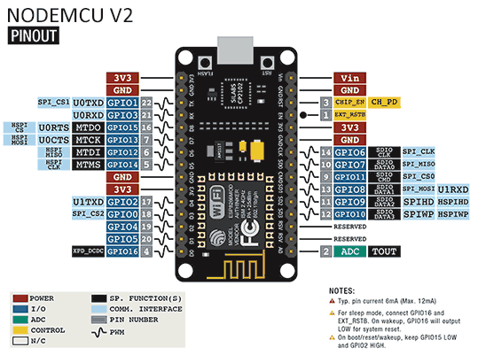
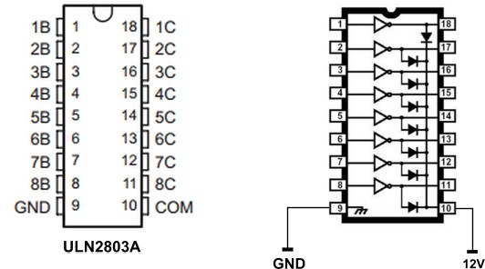

## Escornabot nodeMCU   

[Montaje electrico](https://escornabot.com/web/es/content/cableado)

[Ajustes de velocidad y giro](https://pablorubma.cc/como-modificar-movimientos-escornabot/)

[Tutorial adafruit sobre motores paso a paso y ULN2803a](https://learn.adafruit.com/adafruits-raspberry-pi-lesson-10-stepper-motors?view=all)
