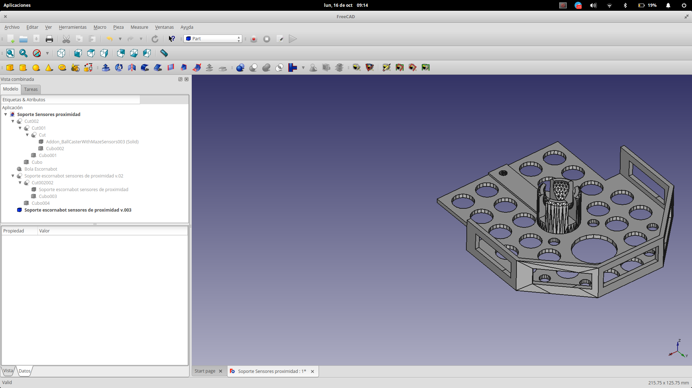

# Escornabot

## Experiencias

[Experiencia en bibliotecas gallegas](http://www.edu.xunta.es/biblioteca/blog/?q=category/19/87)

## [Wifi](http://mgesteiro.com/cousas/escornabot-wifi/)

## Botoneras

[Botonera elecfreaks [4.5$]](http://www.elecfreaks.com/estore/octopus-adkeypad.html)

[ADKey de aliexpress (2.6€)](https://es.aliexpress.com/store/product/5PCS-AD-Keyboard-Simulate-Five-Key-Module-Analog-Button-for-Arduino-Sensor-Expansion-Board-NEW/2221053_32779886681.html)

## Programación

[Programación de la Botonera de elecfreaks](http://www.elecfreaks.com/wiki/index.php?title=Octopus_ADKeypad)

      //ADKeyboard Module
      int adc_key_val[5] ={20,50, 100, 200, 600 };
      int NUM_KEYS = 5;
      int adc_key_in;
      int key=-1;
      int oldkey=-1;
      void setup()
      {
        pinMode(13, OUTPUT);  //we'll use the debug LED to output a heartbeat
        Serial.begin(9600); // 9600 bps
      }
      void loop()
      {
        adc_key_in = analogRead(0);    // read the value from the sensor
        digitalWrite(13,LOW);
        key = get_key(adc_key_in);  // convert into key press

        if (key != oldkey)   // if keypress is detected
         {
          delay(50);  // wait for debounce time
          adc_key_in = analogRead(0);    // read the value from the sensor
          key = get_key(adc_key_in);    // convert into key press
          if (key != oldkey)    
          {   
            oldkey = key;
            if (key >=0){
              digitalWrite(13,HIGH);
              switch(key)
              {
                 case 0:Serial.println("S1 OK");   
                        break;
                 case 1:Serial.println("S2 OK");   
                        break;
                 case 2:Serial.println("S3 OK");   
                        break;
                 case 3:Serial.println("S4 OK");   
                        break;      
                 case 4:Serial.println("S5 OK");   
                        break;  
              }                
            }
          }
        }
       delay(100);
      }
      // Convert ADC value to key number
      int get_key(unsigned int input)
      {
          int k;
          for (k = 0; k < NUM_KEYS; k++)
          {
            if (input < adc_key_val[k])
           {
                  return k;
              }
         }
             if (k >= NUM_KEYS)k = -1;  // No valid key pressed
             return k;
      }
## Complemento para sensores de distancia

(Adaptado del diseño de [jbabio](https://github.com/jbabio) para sensores de TCRT5000 con salida analógica)

([original](https://github.com/jbabio/3dmodel/blob/a0ec6821d4692566b827412c64e4bbaa006a8dee/Brivoi/STL/Addon-BallCasterWithMazeSensors.stl))

[Modelos](./modelos)
